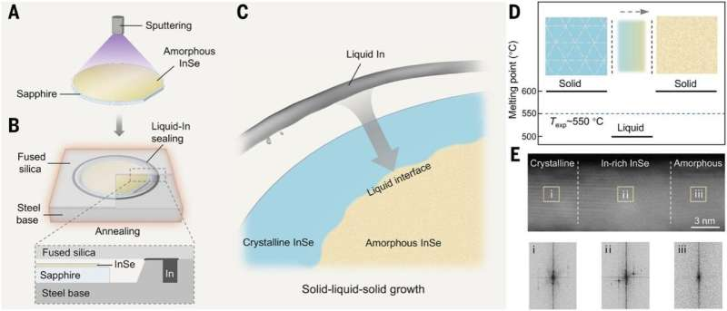

---

title: Golden Semiconductor
description: An overview of indium selenide, its properties, advantages over silicon, and its realistic role in future electronics.
pubDate: 2026-01-26
heroImage: ../../assets/inse-header.png
---

Jump Straight to

- [Introduction](#introduction)
- [What Is Indium Selenide?](#what-is-indium-selenide)
- [Why Indium Selenide Is Better Than Silicon](#why-indium-selenide-is-better-than-silicon)
- [Can Indium Selenide Replace Silicon?](#can-indium-selenide-replace-silicon)
- [References](#references)

## Introduction

Indium selenide (InSe), first synthesized in 1910, has recently gained strong attention as a high-performance two-dimensional (2D) semiconductor. While indium-based compounds have been used for decades in optoelectronics and solar cells, atomically thin InSe exhibits electrical and optical properties that are not achievable in bulk materials. A major milestone was reached in 2025 with the demonstration of wafer-scale 2D InSe growth, addressing long-standing scalability challenges. As conventional silicon devices approach fundamental physical limits, InSe is now being explored for ultra-low-power electronics, advanced computing hardware, and flexible devices.

## What Is Indium Selenide?

Indium selenide is a compound semiconductor the **Golden Semiconductor** composed of indium and selenium. It has a naturally layered crystal structure, where individual atomic layers are held together by weak van der Waals forces. This structure allows InSe to be exfoliated or synthesized as extremely thin sheets, down to just a few atomic layers.

InSe can be produced in bulk crystalline form by high-temperature synthesis followed by controlled cooling. Thin films and 2D layers can also be fabricated using chemical and vapor-based deposition techniques. Due to its direct bandgap (in thin layers), high electron mobility, and strong light–matter interaction, InSe is being actively studied for transistors, photodetectors, sensors, and next-generation optoelectronic devices.

## Why Indium Selenide Is Better Than Silicon

Indium selenide offers several advantages over silicon, particularly at nanometer and atomic thickness scales.

* InSe maintains excellent electrical performance even when reduced to a few atomic layers, whereas silicon suffers from severe mobility degradation at such dimensions.
* Two-dimensional InSe exhibits very high electron mobility, enabling faster switching speeds and lower power consumption.
* InSe-based devices can operate at lower voltages, making them attractive for energy-efficient and AI-oriented hardware.
* The layered structure allows mechanical flexibility, which is not possible with crystalline silicon, enabling bendable and wearable electronics.

As transistor scaling becomes increasingly difficult with silicon, these properties position InSe as a strong candidate for future electronic architectures.

## Can Indium Selenide Replace Silicon?

Indium selenide is unlikely to fully replace silicon in mainstream semiconductor manufacturing. Silicon remains dominant because it is extremely abundant, inexpensive, and supported by a highly mature global fabrication ecosystem. In contrast, indium is a relatively rare element obtained mainly as a by-product of zinc mining, making InSe significantly more expensive and sensitive to supply constraints.

As a result, InSe is better viewed as a complementary material rather than a replacement. It is most suitable for specialized, high-performance applications such as ultra-scaled transistors, low-power logic, flexible electronics, and advanced sensing technologies, where performance gains justify higher material costs.

## References

* [Indium Selenides - ScienceDirect Overview](https://www.sciencedirect.com/topics/physics-and-astronomy/indium-selenides)
* [Wafer-Scale 2D InSe Semiconductor Breakthrough](https://www.linkedin.com/posts/erd-ltd-inc_wafer-scale-2d-inse-semiconductors-achieve-activity-7364298960867364864-CAZ6/)
